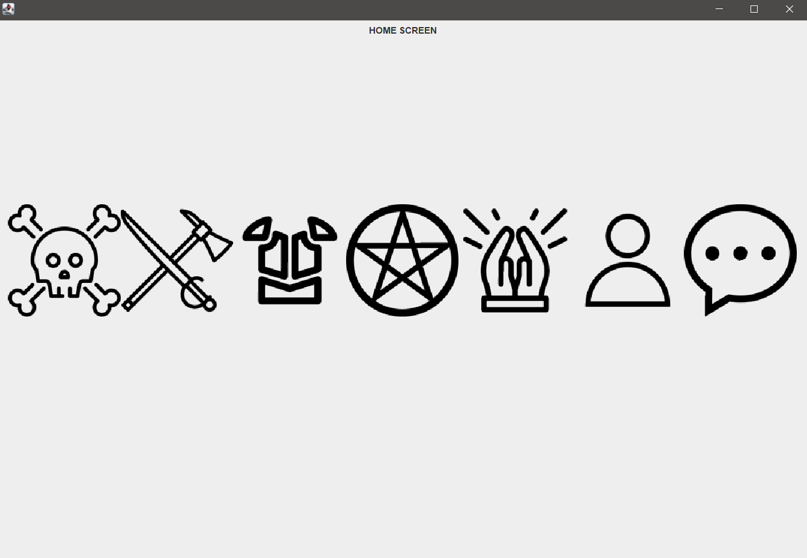

# Elden Ring related database + GUI

#### [Inspiration](https://eldenring.wiki.fextralife.com/Elden+Ring+Wiki)

This is the mandatory project required for the database course (DB) in the second year at Technical University of 
Cluj-Napoca. Its purpose is to familiarize one with the SQL language, the most common sql servers, and an IDE 
(DBeaver or DataGrip).

## Table of Contents

- [Description](#Description)
  - [Preliminaries](#Preliminaries) 
  - [Screens](#Screens)
  - [Java Class Diagram](#Java)
  - [Database](#Database)
- [Installation](#installation)
- [Usage](#usage)
- [Further developments](#Further-developments)
- [License](#license)

## Description

### Preliminaries

The project is composed of three main elements: 
- the GUI made in Java and JavaSwing 
- the backend database based on postgres
- the connection between them based on the JDBC driver

The purpose of the project is to simulate insertion of reviews of specific items from a database under some general 
assumptions (basic CRUD operations).  

### Screens

The GUI is composed of 8 "screens" (pages, frames):
- Home Screen
  
    
    The first screen that appears when the application is run. Contains 7 buttons that change the screen to another specific
    screen depending on what button is pressed. The buttons are implemented as images that aim to reflect visually what each
    of them redirects to. 
      

- Other Screens:
  - Boss Screen
  - Weapon Screen
  - Armor Screen
  - Incantation Screen
  - Sorcery Screen
  - Character Screen
  - Comment Screen

  
  
  These screens display the data taken from the table that is part of the database. All these screens contain a **home
button** that changes the screen back to the home screen and an **insert comment button** that opens a pop-up window:

Here, the user can fill in this form that is saved in the **comments** table inside the database. No filtering of the comment text is
done, but the table is equipped with a trigger that checks if the id of the item the comment targets exists inside those
specific tables. When the *OK* button is pressed, the script sends an *INSERT INTO table_name VALUES* request to the postgres server.
However, updates of the table in the comment screen are performed only when the screen is accessed. This may cause problems in the 
future if one decides to develop the comment screen more, but for the sake of this project this does not impact the utility and aim of the
program.

Every screen but the home one is equipped with the **insert comment button** to make it easier to get the id
of the item the user tries to comment on (the id is case-sensitive and sometimes long enough to cause misspells, this concern
is partially solved by the ability to select fields inside the displayed table and copy-paste the information inside them into
the id field). All screens perform a *SELECT * FROM table_name*.

### Java

The frontend of the project is made using Java Swing. Its base building block is the CardLayout: each screen is a "card" inside
a "deck of cards" and the frontend scripts manage the visibility of them. Only one card is visible at any time. The main issue with this
approach is that all cards must be created before being inserted into the deck meaning that some complex functionalities that  may 
suffer (in fact this proved to be a problem I had to wrap around when I worked on the comment screen at the refresh of the data after a new comment is
inserted). The card themselves are JPanels that are hardcoded to look in that certain way thanks to the functionalities Swing offers (layouts,
alignments etc.)
The backend is primarily the connection component that establishes a relationship between the database and the Java gui. I created some queries
that help me manage the data that is to be displayed in each screen. Even though I tried to minimize the number of parameters a method that fetches data
from the database requires, I maximized the number of queries the database gets. For example when the weapon screen is selected, a request to get all data
is processed. This means Java asks about three queries: how many rows, how many columns and fetch the data itself. The first two queries are needed because
I decided to use a JTable whose constructor requires a matrix of predefined dimensions. Because the data type a JTable asks for is String I had to give up
displaying any kind of pictures because trying to do that would require a lot of additional logic I did not find that relevant for what I tried to achieve. 

### Database

  
## Installation

Download the project, the dependencies, create the database, fill the database (TODO smth about this) and run the application 
in an IDE such as IntellijIdea.

## Usage

When the app is run this widow opens:
TODO add image 
Any button can be pressed.

## Further developments

A lot of things I would do differently if I were to start this project again from scratch. I am not pleased by how the abstraction
process turned out; I feel this is one of the main improvements I would focus on in a future "refurbish" of this project (I believe
some interfaces may improve the functionality and the development possibilities from there on, as well as making the overall code
easier to maintain).
In terms of functionality all sorts of improvements can be added:
- a more customizable relationship with the postgres server that is able to perform more complex queries implemented as a new screen
whose main feature is a search bar or a filter-like form.
- creating a specific page for each item where more information is displayed such as images, videos. (Such a feature should work great especially
for the incantation or sorcery database entries, [see this](https://eldenring.wiki.fextralife.com/Comet+Azur)). This would be a massive
improvement in the look and feel of the application.
- I love the way the site implemented the "build calculator", however this would require a complete redesign of all I did, mostly the database itself. 

## License

## Additional Sections (Optional)